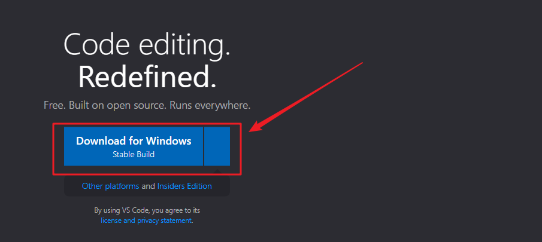
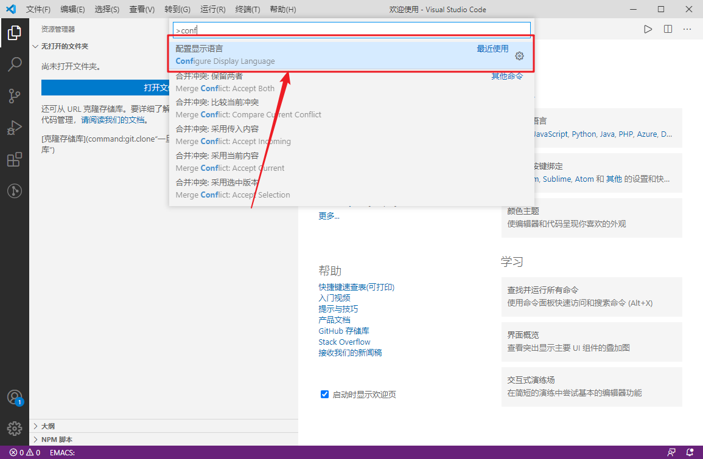
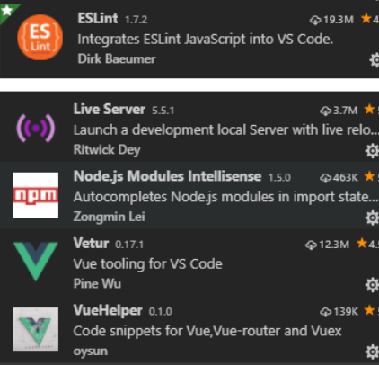
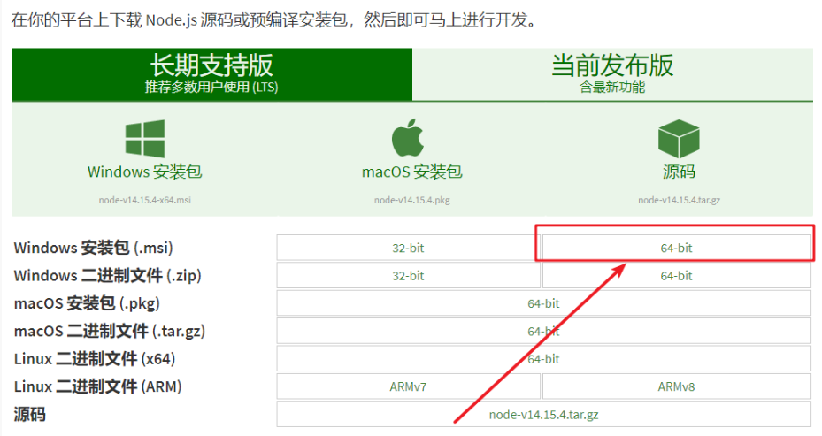

# 大前端进阶

## 课程目标

1、前端开发和前端开发工具
2、Nodejs安装及快速入门
3、Es6的新语法糖
4、Npm包管理器
5、Babel的安装作用
6、模块化管理
7、Webpack打包和编译
8、如何快速构建一个nodejs项目vue-element-admin

## 1. 概述和前端工具vscode安装

前端开发是创建Web页面或app等前端界面呈现给用户的过程，通过HTML，CSS及JavaScript以及衍生出来的各种技术、框架、解决方案，来实现互联网产品的用户界面交互 [1] 。它从网页制作演变而来，名称上有很明显的时代特征。在互联网的演化进程中，网页制作是Web1.0时代的产物，**==早期网站主要内容都是静态，以图片和文字为主==**，用户使用网站的行为也以浏览为主。随着互联网技术的发展和HTML5，CSS3的应用，现代网页更加美观，交互效果显著，功能更加强大。

移动互联网带来了大量高性能的移动终端设备以及快速的无线网络，HTML5，node.js的广泛应用，各类框架类库层出不穷。 

当下国内的大部分互联网公司只有前端工程师和后端工程师，中间层的工作有的由前端来完成，有的由后端来完成。

### 1.1 下载安装VScode

下载地址：https://code.visualstudio.com/





### 1.2 中文界面配置

1. 首先安装中文插件：Chinese (Simplified) Language Pack for Visual Studio Code
   

2. 右下角弹出是否重启vs，点击“yes”
   

   汉化成功

   

3. 有些机器重启后如果界面没有变化，则 点击 左边栏Manage -> Command Paletet…【Ctrl+Shift+p】
4. 在搜索框中输入“configure display language”，回车
   
5. 选择’zh-cn’
   

6. 重启vs

### 1.3 插件安装

为方便后续开发，建议安装如下插件


### 1.4 设置字体大小

左边栏Manage -> settings -> 搜索 “font” -> Font size

### 1.5 开启完整的Emmet语法支持

设置中搜索 Emmet：启用如下选项，必要时重启vs


### 1.1.5、视图

查看—> 外观—> 向左移动侧边栏


## 2. Node.js

### 2.1 Nodejs介绍与安装

目标： 了解nodejs、并且在本地安装好这个软件
官网： http://nodejs.cn/
介绍：

* Node 是一个让 JavaScript 运行在服务端的开发平台，它让 JavaScript 成为与PHP、Python、Perl、Ruby 等服务端语言平起平坐的脚本语言。  发布于2009年5月，由Ryan Dahl开发，实质是对Chrome V8引擎进行了封装。

* 简单的说 Node.js 就是运行在服务端的 JavaScript。 Node.js 是一个基于Chrome JavaScript 运行时建立的一个平台。底层架构是：javascript. 文件后缀：.js
* Node.js是一个事件驱动I/O服务端JavaScript环境，基于Google的V8引擎，V8引擎执行Javascript的速度非常快，性能非常好。


下载对应你系统的Node.js版本:
下载地址：https://nodejs.org/zh-cn/download
帮助文档：https://nodejs.org/zh-cn/docs
关于Nodejs：https://nodejs.org/zh-cn/about



安装默认安装即可，安装完成之后，查看是否安装成功：

```
node -v
```


**小结**

> Nodejs是一门计算机语言，运行在系统中的v8（jvm）引擎中。文件后缀是 `js` 运行的命令是：node

### 2.2 Nodejs入门

目标： 控制台输出字符串、使用函数、进行模块化编程

#### 1. 快速入门-Hello World

1. 创建文件夹 nodejs

2. 创建 helloworld.js

   * 类似于java中的`System.out.println("")`

     ```js
     console.log('Hello World!!!')
     ```

     运行：`node helloworld.js`

     结果：hello world!!!

3. 打开命令行终端：Ctrl + Shift + y

浏览器的内核包括两部分核心：

- DOM渲染引擎；
- java script 解析器（js引擎）
- js运行在浏览器内核中的js引擎内部

**小结**

==Node.js是脱离浏览器环境运行的JavaScript程序，基于V8 引擎==

#### 2. Node - 实现请求响应

1. 创建 httpserver.js ；

   ```js
   // 导入模块是require 就类似于import java.io 
   const http = require('http');
   // 1: 创建一个httpserver服务
   http.createServer(function(request,response){    
       // 浏览器怎么认识hello server!!!    
       
       //这句话的含义是：告诉浏览器将以text-plain去解析hello server 这段数据。  
       response.writeHead(200,{'Content-type':'text/plain'});   
       
       // 给浏览器输出内容    
       response.end("<strong>hello server!!!</strong>");
   }).listen(8888);
   console.log("你启动的服务是：http://localhpst:8888以启动成功!!");
   // 2: 监听一端口8888
   // 3: 启动运行服务 node httpserver.js
   // 4: 在浏览器访问http://localhost:8888
   ```

2. 运行服务器程序；

   ```bash
   node httpserver.js
   ```

3. 服务器启动成功后，在浏览器中输入：http://localhost:8888/ 查看webserver成功运行，并输出html页面
4. 停止服务：ctrl + c

#### 3. Node-操作MYSQL数据库

参考：https://www.npmjs.com/package/mysql

1. 安装mysql依赖

   ```bash
   npm install mysql
   ```

2. 定义db.js进行操作

   ```js
   //1: 导入mysql依赖包,  mysql属于第三方的模块就类似于 java.sql一样的道理
   var mysql = require("mysql");
   // 1: 创建一个mysql的Connection对象
   // 2: 配置数据连接的信息 
   var connection =mysql.createConnection({
       host:"127.0.0.1",
       port:3306,
       user:"root",
       password:"123456",
       database:"testdb"
   });
   // 3：开辟连接
   connection.connect();
   // 4: 执行curd
   connection.query("select * from kss_user",function(error,results,fields){
       // 如果查询出错，直接抛出
       if(error)throw error;
       // 查询成功
       console.log("results = ",results);
   });
   // 5: 关闭连接
   connection.end();
   // 最后一步：运行node db.js 查看效果
   ```

3. 新建数据库:`db_test`和表`kss_user`表

   ```mysql
   /*
    Navicat MySQL Data Transfer
    Source Server         : localhost
    Source Server Type    : MySQL
    Source Server Version : 60011
    Source Host           : localhost:3306
    Source Schema         : testdb
    Target Server Type    : MySQL
    Target Server Version : 60011
    File Encoding         : 65001
    Date: 20/01/2021 21:38:55
   */
   SET NAMES utf8mb4;
   SET FOREIGN_KEY_CHECKS = 0;
   -- ----------------------------
   -- Table structure for kss_user
   -- ----------------------------
   DROP TABLE IF EXISTS `kss_user`;
   CREATE TABLE `kss_user`  (
     `id` int(11) NOT NULL,
     `name` varchar(255) CHARACTER SET utf8 COLLATE utf8_general_ci NULL DEFAULT NULL,
     PRIMARY KEY (`id`) USING BTREE
   ) ENGINE = InnoDB CHARACTER SET = utf8 COLLATE = utf8_general_ci ROW_FORMAT = Compact;
   -- ----------------------------
   -- Records of kss_user
   -- ----------------------------
   INSERT INTO `kss_user` VALUES (1, '学相伴');
   INSERT INTO `kss_user` VALUES (2, '广东');
   SET FOREIGN_KEY_CHECKS = 1;
   ```

4. 运行db.js

   ```bash
   node db
   ```


> **如果想开发更复杂的基于Node.js的应用程序后台，需要进一步学习Node.js的Web开发相关框架 express，art-template、koa等**