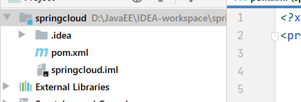
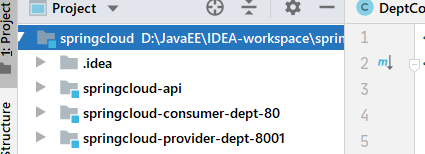
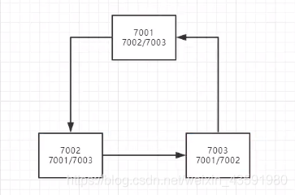

# SpringCloud

**微服务四个问题：**

1. 服务很多，客户端该怎么访问？
2. 服务很多，服务之间如何通信？
3. 服务很多，如何治理？
4. 服务挂了怎么办？

**三种主流解决方案：**

Spring Cloud 生态！

1. Spring Cloud NetFlix 一站式解决方案
   * api网关，zuul组件
   * Feign --- HttpClient --- http通信方式，同步，阻塞
   * 服务注册发现：Eureka
   * 熔断机制：Hystrix
2. Apache Dubbo Zookeeper 半自动，需要整合别人的
   * API：没有，找第三方组件，或者自己实现
   * Dubbo
   * Zookeeper
   * 没有：借助Hystrix
   * Dubbo这个方案并不完善~
3. Spring Cloud Alibaba 最新的一站式解决方案，更简单

新概念：服务概念～ server Mesh

* istio

**万变不离其宗**

1. API（路由问题）
2. HTTP, RPC （通信问题）
3. 注册和发现 （高可用问题）
4. 熔断机制 （服务降级问题）

**网络不可靠！**

## 1. 常见面试题

1. 什么是微服务？

2. 微服务之间是如何独立通讯的？

3. SpringCloud和Dubbo有哪些区别？

4. SpringBoot和SpringCloud，请你谈谈对他们的理解

   > **SpringCloud：**
   >
   > SpringCloud, 基于SpringBoot提供了一套微服务解决方案，包括**服务注册于发现，配置中心，全链路监控,服务网关，负载均衡，熔断器**等组件，除了基于NetFlix的开源组件做高度抽象封装之外，还有一些选型中立的开源组件。
   >
   > **SpringBoot:**
   >
   > SpringBoot并没有重复早轮子，他只是将目前各家公司开发的比较成熟，经得起实际考验的服务框架组合起来，通过SpringBoot风格进行再封装，屏蔽掉了复杂的配置和实现原理，最终给开发者留出了一套简单易懂，易部署和易维护的分布式系统开发工具包。
   >
   > 

5. 什么是服务熔断？什么是服务降级？

6. 微服务的优缺点分别是什么？说下你在项目开发中遇到的坑

7. 你所知道的微服务技术栈由哪些？请列举一二

8. eureka和zookeeper都可以提供服务注册与发现的功能，请说说两者的区别？


## 2. 微服务概述

### 2.1 什么是微服务

**什么是微服务？**微服务(Microservice Architecture) 是近几年流行的一种架构思想，关于它的概念很难一言以蔽之。

究竟什么是微服务呢？我们在此引用ThoughtWorks 公司的首席科学家 Martin Fowler 于2014年提出的一段话：

原文：https://martinfowler.com/articles/microservices.html

汉化：https://www.cnblogs.com/liuning8023/p/4493156.html

就目前而言，对于微服务，业界并没有一个统一的，标准的定义。
但通常而言，微服务架构是一种架构模式，或者说是一种架构风格，**它提倡将单一的应用程序划分成一组小的服务**，每个服务运行在其独立的自己的进程内，服务之间互相协调，互相配置，为用户提供最终价值，服务之间采用轻量级的通信机制(HTTP)互相沟通，每个服务都围绕着具体的业务进行构建，并且能狗被独立的部署到生产环境中，另外，应尽量避免统一的，集中式的服务管理机制，对具体的一个服务而言，应该根据业务上下文，选择合适的语言，工具(Maven)对其进行构建，可以有一个非常轻量级的集中式管理来协调这些服务，可以使用不同的语言来编写服务，也可以使用不同的数据存储。

**我们从技术维度来理解下：**

- 微服务化的核心就是将传统的一站式应用，根据业务拆分成一个一个的服务，彻底地去耦合，每一个微服务提供单个业务功能的服务，一个服务做一件事情，从技术角度看就是一种小而独立的处理过程，类似进程的概念，能够自行单独启动或销毁，拥有自己独立的数据库。

### 2.2 微服务与微服务架构

**微服务**

强调的是服务的大小，它关注的是某一个点，是具体解决某一个问题/提供落地对应服务的一个服务应用，狭义的看，可以看作是IDEA中的一个个微服务工程，或者Model。

> IDEA 工具里面使用Maven开发的一个个独立的小Model，它具体是使用SpringBoot开发的一个小模块，专业的事情交给专业的模块来做，一个模块就做着一件事情。强调的是一个个的个体，每个个体完成一个具体的任务或者功能。

**微服务架构**

一种新的架构形式，Martin Fowler 于2014年提出。

微服务架构是一种架构模式，它提倡将单一应用程序划分成一组小的服务，服务之间相互协调，互相配合，为用户提供最终价值。每个服务运行在其独立的进程中，服务与服务之间采用轻量级的通信机制(如HTTP)互相协作，每个服务都围绕着具体的业务进行构建，并且能够被独立的部署到生产环境中，另外，应尽量避免统一的，集中式的服务管理机制，对具体的一个服务而言，应根据业务上下文，选择合适的语言、工具(如Maven)对其进行构建。


### 2.3 微服务优缺点

**优点**

* 单一职责原则；
* 每个服务足够内聚，足够小，代码容易理解，这样能聚焦一个指定的业务功能或业务需求；
* 开发简单，开发效率高，一个服务可能就是专一的只干一件事；
* 微服务能够被小团队单独开发，这个团队只需2-5个开发人员组成；
* 微服务是松耦合的，是有功能意义的服务，无论是在开发阶段或部署阶段都是独立的；
* 微服务能使用不同的语言开发；
* 易于和第三方集成，微服务允许容易且灵活的方式集成自动部署，通过持续集成工具，如jenkins，Hudson，bamboo；
* 微服务易于被一个开发人员理解，修改和维护，这样小团队能够更关注自己的工作成果，无需通过合作才能体现价值；
* 微服务允许利用和融合最新技术；
* **微服务只是业务逻辑的代码，不会和HTML，CSS，或其他的界面混合;**
* **每个微服务都有自己的存储能力，可以有自己的数据库，也可以有统一的数据库；**

**缺点**

* 开发人员要处理分布式系统的复杂性；
* 多服务运维难度，随着服务的增加，运维的压力也在增大；
* 系统部署依赖问题；
* 服务间通信成本问题；
* 数据一致性问题；
* 系统集成测试问题；
* 性能和监控问题；

### 2.4 微服务技术栈有那些？

| **微服务技术条目**                     | **落地技术**                                                 |
| -------------------------------------- | ------------------------------------------------------------ |
| 服务开发                               | SpringBoot、Spring、SpringMVC等                              |
| 服务配置与管理                         | Netfix公司的Archaius、阿里的Diamond等                        |
| 服务注册与发现                         | Eureka、Consul、Zookeeper等                                  |
| 服务调用                               | Rest、PRC、gRPC                                              |
| 服务熔断器                             | Hystrix、Envoy等                                             |
| 负载均衡                               | Ribbon、Nginx等                                              |
| 服务接口调用(客户端调用服务的简化工具) | Fegin等                                                      |
| 消息队列                               | Kafka、RabbitMQ、ActiveMQ等                                  |
| 服务配置中心管理                       | SpringCloudConfig、Chef等                                    |
| 服务路由(API网关)                      | Zuul等                                                       |
| 服务监控                               | Zabbix、Nagios、Metrics、Specatator等                        |
| 全链路追踪                             | Zipkin、Brave、Dapper等                                      |
| 数据流操作开发包                       | SpringCloud Stream(封装与Redis，Rabbit，Kafka等发送接收消息) |
| 时间消息总栈                           | SpringCloud Bus                                              |
| 服务部署                               | Docker、OpenStack、Kubernetes等                              |

### 2.5 为什么选择SpringCloud作为微服务架构

1. 选型依据
   1. 整体解决方案和框架成熟度
   2. 社区热度
   3. 可维护性
   4. 学习曲线

2. 当前各大IT公司用的微服务架构有那些？

   1. 阿里：dubbo+HFS

   2. 京东：JFS

   3. 新浪：Motan

   4. 当当网：DubboX

      …

3. 各微服务框架对比

| **功能点/服务框架** | Netflix/SpringCloud                                          | Motan                                                       | gRPC                      | Thri t   | Dubbo/DubboX                        |
| ------------------- | ------------------------------------------------------------ | ----------------------------------------------------------- | ------------------------- | -------- | ----------------------------------- |
| 功能定位            | 完整的微服务框架                                             | RPC框架，但整合了ZK或Consul，实现集群环境的基本服务注册发现 | RPC框架                   | RPC框架  | 服务框架                            |
| 支持Rest            | 是，Ribbon支持多种可拔插的序列号选择                         | 否                                                          | 否                        | 否       | 否                                  |
| 支持RPC             | 否                                                           | 是(Hession2)                                                | 是                        | 是       | 是                                  |
| 支持多语言          | 是(Rest形式)                                                 | 否                                                          | 是                        | 是       | 否                                  |
| 负载均衡            | 是(服务端zuul+客户端Ribbon)，zuul-服务，动态路由，云端负载均衡Eureka（针对中间层服务器） | 是(客户端)                                                  | 否                        | 否       | 是(客户端)                          |
| 配置服务            | Netfix Archaius，Spring Cloud Config Server 集中配置         | 是(Zookeeper提供)                                           | 否                        | 否       | 否                                  |
| 服务调用链监控      | 是(zuul)，zuul提供边缘服务，API网关                          | 否                                                          | 否                        | 否       | 否                                  |
| 高可用/容错         | 是(服务端Hystrix+客户端Ribbon)                               | 是(客户端)                                                  | 否                        | 否       | 是(客户端)                          |
| 典型应用案例        | Netflix                                                      | Sina                                                        | Google                    | Facebook |                                     |
| 社区活跃程度        | 高                                                           | 一般                                                        | 高                        | 一般     | 2017年后重新开始维护，之前中断了5年 |
| 学习难度            | 中等                                                         | 低                                                          | 高                        | 高       | 低                                  |
| 文档丰富程度        | 高                                                           | 一般                                                        | 一般                      | 一般     | 高                                  |
| 其他                | Spring Cloud Bus为我们的应用程序带来了更多管理端点           | 支持降级                                                    | Netflix内部在开发集成gRPC | IDL定义  | 实践的公司比较多                    |

## 3. SpringCloud入门概述

### 3.1 SpringCloud是什么？

Spring官网：https://spring.io/


SpringCloud，基于SpringBoot提供了一套微服务解决方案，包括服务注册与发现，全链路监控，服务网关，负载均衡，熔断器等组件，除了基于NetFlix的开源组件做高度抽象封装之外，还有一些选型中立的开源组件。

SpringCloud利用SpringBoot的开发便利性，巧妙地简化了分布式系统基础设施的开发，SpringCloud为开发人员提供了快速构建分布式系统的一些工具，**包括配置管理，服务发现，断路器，路由，微代理，事件总线，全局锁，决策竞选，分布式会话等等**，他们都可以用SpringBoot的开发风格做到一键启动和部署。

SpringBoot并没有重复造轮子，它只是将目前各家公司开发的比较成熟，经得起实际考验的服务框架组合起来，通过SpringBoot风格进行再封装，屏蔽掉了复杂的配置和实现原理，**最终给开发者留出了一套简单易懂，易部署和易维护的分布式系统开发工具包**。

SpingCloud是分布式微服务框架下的一站式解决方案，是各个微服务架构落地技术的集合体，俗称微服务全家桶。

### 3.2 SpringCloud和SpringBoot的关系

* SpringBoot专注于快速方便的开发单个个体微服务；jar包
* SpringCloud是关注全局的微服务协调整理治理框架，它将SpringBoot开发的一个个单体微服务，整合并管理起来，为各个微服务之间提供：配置管理、服务发现、断路器、路由、为代理、事件总栈、全局锁、决策竞选、分布式会话等等集成服务；
* SpringBoot可以离开SpringCloud独立使用，开发项目，但SpringCloud离不开SpringBoot，属于依赖关系；
* SpringBoot专注于快速、方便的开发单个个体微服务，SpringCloud关注全局的服务治理框架；

### 3.3 Dubbo 和 SpringCloud技术选型

1. **分布式+服务治理Dubbo**
    目前成熟的互联网架构，应用服务化拆分 + 消息中间件

  

2. **Dubbo 和 SpringCloud对比**
    可以看一下社区活跃度：

  https://github.com/dubbo

  https://github.com/spring-cloud

对比结果：

|              | Dubbo         | SpringCloud                  |
| ------------ | ------------- | ---------------------------- |
| 服务注册中心 | Zookeeper     | Spring Cloud Netfilx Eureka  |
| 服务调用方式 | RPC           | REST API                     |
| 服务监控     | Dubbo-monitor | Spring Boot Admin            |
| 断路器       | 不完善        | Spring Cloud Netfilx Hystrix |
| 服务网关     | 无            | Spring Cloud Netfilx Zuul    |
| 分布式配置   | 无            | Spring Cloud Config          |
| 服务跟踪     | 无            | Spring Cloud Sleuth          |
| 消息总栈     | 无            | Spring Cloud Bus             |
| 数据流       | 无            | Spring Cloud Stream          |
| 批量任务     | 无            | Spring Cloud Task            |

**最大区别：Spring Cloud 抛弃了Dubbo的RPC通信，采用的是基于HTTP的REST方式**

严格来说，这两种方式各有优劣。虽然从一定程度上来说，后者牺牲了服务调用的性能，但也避免了上面提到的原生RPC带来的问题。而且REST相比RPC更为灵活，服务提供方和调用方的依赖只依靠一纸契约，不存在代码级别的强依赖，这个优点在当下强调快速演化的微服务环境下，显得更加合适。

**品牌机和组装机的区别**

**社区支持与更新力度的区别**

**总结：**二者解决的问题域不一样：Dubbo的定位是一款RPC框架，而SpringCloud的目标是微服务架构下的一站式解决方案。

### 3.4 SpringCloud能干嘛？

* Distributed/versioned configuration 分布式/版本控制配置
* Service registration and discovery 服务注册与发现
* Routing 路由
* Service-to-service calls 服务到服务的调用
* Load balancing 负载均衡配置
* Circuit Breakers 断路器
* Distributed messaging 分布式消息管理
  …

### 3.5 SpringCloud下载

官网：http://projects.spring.io/spring-cloud/

版本号有点特别：


SpringCloud没有采用数字编号的方式命名版本号，而是采用了伦敦地铁站的名称，同时根据字母表的顺序来对应版本时间顺序，比如最早的Realse版本：Angel，第二个Realse版本：Brixton，然后是Camden、Dalston、Edgware，目前最新的是Hoxton SR4 CURRENT GA通用稳定版。

**自学参考书：**

* SpringCloud Netflix 中文文档：https://springcloud.cc/spring-cloud-netflix.html
* SpringCloud 中文API文档(官方文档翻译版)：https://springcloud.cc/spring-cloud-dalston.html
* SpringCloud中国社区：http://springcloud.cn/
* SpringCloud中文网：https://springcloud.cc

## 4. Rest学习环境搭建

### 4.1 介绍

- 我们会使用一个Dept部门模块做一个微服务通用案例**Consumer**消费者(**Client**)通过REST调用**Provider**提供者(**Server**)提供的服务。
- 回顾Spring，SpringMVC，Mybatis等以往学习的知识。
- Maven的分包分模块架构复习。

```
一个简单的Maven模块结构是这样的：

-- app-parent: 一个父项目(app-parent)聚合了很多子项目(app-util\app-dao\app-web...)
  |-- pom.xml
  |
  |-- app-core
  ||---- pom.xml
  |
  |-- app-web
  ||---- pom.xml
  ......
```

 一个父工程带着多个Moudule子模块

MicroServiceCloud父工程(Project)下初次带着3个子模块(Module)

* microservicecloud-api 【封装的整体entity/接口/公共配置等】
* microservicecloud-consumer-dept-80 【服务提供者】
* microservicecloud-provider-dept-8001 【服务消费者】

### 4.2 SpringCloud版本选择

大版本说明

| SpringBoot   | SpringCloud                                                  | 关系                                     |
| ------------ | ------------------------------------------------------------ | ---------------------------------------- |
| 1.2.x        | Angel版本(天使)                                              | 兼容SpringBoot1.2x                       |
| 1.3.x        | Brixton版本(布里克斯顿)                                      | 兼容SpringBoot1.3x，也兼容SpringBoot1.4x |
| 1.4.x        | Camden版本(卡姆登)                                           | 兼容SpringBoot1.4x，也兼容SpringBoot1.5x |
| 1.5.x        | Dalston版本(多尔斯顿)                                        | 兼容SpringBoot1.5x，不兼容SpringBoot2.0x |
| 1.5.x        | Edgware版本(埃奇韦尔)                                        | 兼容SpringBoot1.5x，不兼容SpringBoot2.0x |
| 2.0.x        | Finchley版本(芬奇利)                                         | 兼容SpringBoot2.0x，不兼容SpringBoot1.5x |
| 2.1.x        | Greenwich版本(格林威治)                                      |                                          |
| 2.2.x, 2.3.x | [Hoxton](https://github.com/spring-cloud/spring-cloud-release/wiki/Spring-Cloud-Hoxton-Release-Notes) |                                          |

**实际开发版本关系**

| spring-boot-starter-parent |              | spring-cloud-dependencles |              |
| -------------------------- | ------------ | ------------------------- | ------------ |
| **版本号**                 | **发布日期** | **版本号**                | **发布日期** |
| 1.5.2.RELEASE              | 2017-03      | Dalston.RC1               | 2017-x       |
| 1.5.9.RELEASE              | 2017-11      | Edgware.RELEASE           | 2017-11      |
| 1.5.16.RELEASE             | 2018-04      | Edgware.SR5               | 2018-10      |
| 1.5.20.RELEASE             | 2018-09      | Edgware.SR5               | 2018-10      |
| 2.0.2.RELEASE              | 2018-05      | Fomchiey.BULD-SNAPSHOT    | 2018-x       |
| 2.0.6.RELEASE              | 2018-10      | Fomchiey-SR2              | 2018-10      |
| 2.1.4.RELEASE              | 2019-04      | Greenwich.SR1             | 2019-03      |

**使用后两个**

### 4.3 创建父工程

- 新建父工程项目springcloud，切记**==Packaging是pom模式==**
- 主要是定义POM文件，将后续各个子模块公用的jar包等统一提取出来，类似一个抽象父类
  

**`pom.xml`**

```xml
<?xml version="1.0" encoding="UTF-8"?>
<project xmlns="http://maven.apache.org/POM/4.0.0"
         xmlns:xsi="http://www.w3.org/2001/XMLSchema-instance"
         xsi:schemaLocation="http://maven.apache.org/POM/4.0.0 http://maven.apache.org/xsd/maven-4.0.0.xsd">
    <modelVersion>4.0.0</modelVersion>

    <groupId>com.haust</groupId>
    <artifactId>springcloud</artifactId>
    <version>1.0-SNAPSHOT</version>
    <!--这部分module会慢慢补充上去的-->
    <modules>
        <module>springcloud-api</module>
        <module>springcloud-provider-dept-8001</module>
        <module>springcloud-consumer-dept-80</module>
        <module>springcloud-eureka-7001</module>
        <module>springcloud-eureka-7002</module>
        <module>springcloud-eureka-7003</module>
        <module>springcloud-provider-dept-8002</module>
        <module>springcloud-provider-dept-8003</module>
        <module>springcloud-consumer-dept-feign</module>
        <module>springcloud-provider-dept-hystrix-8001</module>
        <module>springcloud-consumer-hystrix-dashboard</module>
        <module>springcloud-zuul-9527</module>
        <module>springcloud-config-server-3344</module>
        <module>springcloud-config-client-3355</module>
        <module>springcloud-config-eureka-7001</module>
        <module>springcloud-config-dept-8001</module>
    </modules>

    <!--打包方式  pom-->
    <packaging>pom</packaging>

    <properties>
        <project.build.sourceEncoding>UTF-8</project.build.sourceEncoding>
        <maven.compiler.source>1.8</maven.compiler.source>
        <maven.compiler.target>1.8</maven.compiler.target>
        <junit.version>4.12</junit.version>
        <log4j.version>1.2.17</log4j.version>
        <lombok.version>1.16.18</lombok.version>
    </properties>

    <dependencyManagement>
        <dependencies>
            <!--springCloud的依赖-->
            <dependency>
                <groupId>org.springframework.cloud</groupId>
                <artifactId>spring-cloud-dependencies</artifactId>
                <version>Hoxton.SR1</version>
                <type>pom</type>
                <scope>import</scope>
            </dependency>
            <!--SpringBoot-->
            <dependency>
                <groupId>org.springframework.boot</groupId>
                <artifactId>spring-boot-dependencies</artifactId>
                <version>2.2.5.RELEASE</version>
                <type>pom</type>
                <scope>import</scope>
            </dependency>
            <!--数据库-->
            <dependency>
                <groupId>mysql</groupId>
                <artifactId>mysql-connector-java</artifactId>
                <version>8.0.23</version>
            </dependency>
            <dependency>
                <groupId>com.alibaba</groupId>
                <artifactId>druid</artifactId>
                <version>1.1.10</version>
            </dependency>
            <!--SpringBoot 启动器-->
            <dependency>
                <groupId>org.mybatis.spring.boot</groupId>
                <artifactId>mybatis-spring-boot-starter</artifactId>
                <version>1.3.2</version>
            </dependency>
            <!--日志测试~-->
            <dependency>
                <groupId>ch.qos.logback</groupId>
                <artifactId>logback-core</artifactId>
                <version>1.2.3</version>
            </dependency>
            <dependency>
                <groupId>junit</groupId>
                <artifactId>junit</artifactId>
                <version>${junit.version}</version>
            </dependency>
            <dependency>
                <groupId>log4j</groupId>
                <artifactId>log4j</artifactId>
                <version>${log4j.version}</version>
            </dependency>
            <dependency>
                <groupId>org.projectlombok</groupId>
                <artifactId>lombok</artifactId>
                <version>${lombok.version}</version>
            </dependency>
        </dependencies>
    </dependencyManagement>

</project>
```

父工程为springcloud，其下有多个子module，详情参考完整代码了解



### 4.4 创建子工程springcloud-api

创建module`springcloud-api`，添加依赖：

```xml
<!--当前的Module自己需要的依赖，如果父依赖中已经配置了版本，这里就不用写了-->
<dependencies>
    <dependency>
        <groupId>org.projectlombok</groupId>
        <artifactId>lombok</artifactId>
    </dependency>
</dependencies>
```

接下来创建数据库`db01`和表`dept`表示部门：


```mysql
insert into dept (dname, db_source) values ('开发部',DATABASE());
insert into dept (dname, db_source) values ('人事部',DATABASE());
insert into dept (dname, db_source) values ('财务部',DATABASE());
insert into dept (dname, db_source) values ('市场部',DATABASE());
insert into dept (dname, db_source) values ('运维部',DATABASE());
```

接下来创建实体类pojo `Dept`

```java
@Data
@NoArgsConstructor
@Accessors(chain = true) //链式写法
public class Dept implements Serializable { //Dept 实体类 orm 类表关系映射
    private Long deptno; //主键
    private String dname;
    //这个数据是存在那个数据库的字段～ 微服务，一个服务对应一个数据库，同一个信息可能存在不同的数据库
    private String db_source;

    public Dept(String dname) {
        this.dname = dname;
    }
    
    /*
        链式写法：
        Dept dept = new Dept();
        
        dept.setDeptNo(11).setDname('ss').setDb_source('001')
     */
}
```

`springcloud-api`就写完了，微服务差分化后只需要做这些事情

### 4.5 服务提供者：创建子工程springcloud-provider-dept-8001

#### 1. 基础配置

**导入依赖**

springcloud-provider-dept-8001的dao接口调用springcloud-api模块下的pojo，可使用在springcloud-provider-dept-8001的pom文件导入springcloud-api模块依赖的方式：

```xml
<dependencies>
    <!--我们需要拿到实体类，所以要配置api module-->
    <dependency>
        <groupId>com.jin</groupId>
        <artifactId>springcloud-api</artifactId>
        <version>1.0-SNAPSHOT</version>
    </dependency>
    <!--junit-->
    <dependency>
        <groupId>junit</groupId>
        <artifactId>junit</artifactId>
    </dependency>
    <dependency>
        <groupId>mysql</groupId>
        <artifactId>mysql-connector-java</artifactId>
    </dependency>
    <dependency>
        <groupId>com.alibaba</groupId>
        <artifactId>druid</artifactId>
    </dependency>
    <dependency>
        <groupId>ch.qos.logback</groupId>
        <artifactId>logback-core</artifactId>
    </dependency>
    <dependency>
        <groupId>org.mybatis.spring.boot</groupId>
        <artifactId>mybatis-spring-boot-starter</artifactId>
    </dependency>
    <!--test-->
    <dependency>
        <groupId>org.springframework.boot</groupId>
        <artifactId>spring-boot-test</artifactId>
    </dependency>
    <dependency>
        <groupId>org.springframework.boot</groupId>
        <artifactId>spring-boot-starter-web</artifactId>
    </dependency>
    <!--jetty,与tomcat类似的服务器-->
    <dependency>
        <groupId>org.springframework.boot</groupId>
        <artifactId>spring-boot-starter-jetty</artifactId>
    </dependency>
    <!--热部署工具-->
    <dependency>
        <groupId>org.springframework.boot</groupId>
        <artifactId>spring-boot-devtools</artifactId>
    </dependency>
</dependencies>
```

配置`application.yaml`

```yaml
server:
  port: 8001
  
#mybatis配置
mybatis:
  type-aliases-package: com.jin.springcloud.pojo
  config-location: classpath:mybatis/mybatis-config.xml
  mapper-locations: classpath:mybatis/mapper/*.xml
  
#spring配置
spring:
  application:
    name: springcloud-provider-dept
  datasource:
    type: com.alibaba.druid.pool.DruidDataSource #数据源
    driver-class-name: com.mysql.cj.jdbc.Driver
    url: jdbc:mysql://localhost:3306/db01?userSSL=true&useUnicode=true&characterEncoding=utf-8
    username: root
    password: 123456
```

*配置`mybatis-config.xml`(可省略)

```xml
<?xml version="1.0" encoding="UTF-8" ?>
<!DOCTYPE configuration
        PUBLIC "-//mybatis.org//DTD Config 3.0//EN"
        "http://mybatis.org/dtd/mybatis-3-config.dtd">

<configuration>
    <settings>
        <!--开启二级缓存-->
        <setting name="cacheEnabled" value="true"/>
    </settings>
</configuration>
```

#### 2. Mybatis连接

编写接口`DeptDao`

```java
@Mapper
@Repository
public interface DeptDao {
    boolean addDept(Dept dept);

    Dept queryById(Long id);
    
    List<Dept> queryAll();
}
```

编写`DeptMapper.xml`

```xml
<?xml version="1.0" encoding="UTF-8" ?>
<!DOCTYPE mapper
        PUBLIC "-//mybatis.org//DTD Config 3.0//EN"
        "http://mybatis.org/dtd/mybatis-3-mapper.dtd">

<mapper namespace="com.jin.springcloud.dao.DeptDao">
    <insert id="addDept" parameterType="dept">
        insert into dept (dname, db_source) 
        values (#{dname},DATABASE())
    </insert>
    
    <select id="queryById" resultType="dept" parameterType="Long">
        select * from dept where deptno = #{deptno}
    </select>

    <select id="queryAll" resultType="dept">
        select * from dept
    </select>
</mapper>
```

编写接口`DeptService`

```java
public interface DeptService {
    boolean addDept(Dept dept);

    Dept queryById(Long id);

    List<Dept> queryAll();
}
```

编写实现类`DeptServiceImpl`

```java
@Service
public class DeptServiceImpl implements DeptService{
    @Autowired
    private DeptDao deptDao;

    @Override
    public boolean addDept(Dept dept) {
        return deptDao.addDept(dept);
    }

    @Override
    public Dept queryById(Long id) {
        return deptDao.queryById(id);
    }

    @Override
    public List<Dept> queryAll() {
        return deptDao.queryAll();
    }
}
```

#### 3. RESTFul 服务 

编写`DeptController.java`

```java
//提供Restful服务！
@RestController
public class DeptController {
    @Autowired
    private DeptService deptService;

    @PostMapping("/dept/add")
    public boolean addDept(Dept dept) {
        return deptService.addDept(dept);
    }

    @GetMapping("/dept/get/{id}")
    public Dept get(@PathVariable("id") Long id) {
        return deptService.queryById(id);
    }

    @GetMapping("/dept/list")
    public List<Dept> addDept() {
        return deptService.queryAll();
    }
}
```

编写`DeptProvider_8001`启动类

```java
//启动类
@SpringBootApplication
public class DeptProvider_8001 {
    public static void main(String[] args) {
        SpringApplication.run(DeptProvider_8001.class,args);
    }
}
```

启动测试是否能通过端口8001进行各种操作的访问

### 4.6 服务消费者：创建子工程springcloud-consumer-dept-80

`Pom.xml`依赖

```xml
<!--实体类+web-->
<dependencies>
    <dependency>
        <groupId>com.jin</groupId>
        <artifactId>springcloud-api</artifactId>
        <version>1.0-SNAPSHOT</version>
    </dependency>
    <dependency>
        <groupId>org.springframework.boot</groupId>
        <artifactId>spring-boot-starter-web</artifactId>
    </dependency>
    <!--热部署工具-->
    <dependency>
        <groupId>org.springframework.boot</groupId>
        <artifactId>spring-boot-devtools</artifactId>
    </dependency>
</dependencies>
```

`application.yaml`配置端口

```yaml
server:
  port: 80
```

`ConfigBean`配置 RestTemplate

```java
@Configuration
public class ConfigBean { //@Configuration -- spring applicationContext.xml
    @Bean
    public RestTemplate getRestTemplate() {
        return new RestTemplate();
    }
}
```

`DeptComsumerController`

```java
@RestController
public class DeptConsumerController {
    //理解：消费者，不应该有service层
    // RestTemplate ... 供我们直接调用就可以了！注册到spring中
    // (url, 实体 Map,Class<T> responseType)
    @Autowired
    private RestTemplate restTemplate; //提供多种便捷访问远程http服务的方法，简单的Restful服务模板

    private static final String REST_URL_PREFIX = "http://localhost:8001";

    @RequestMapping("/consumer/dept/add")
    public  boolean add(Dept dept) {
        return restTemplate.postForObject(REST_URL_PREFIX + "/dept/add", dept, Boolean.class);
    }
    
    @RequestMapping("/consumer/dept/get/{id}")
    public Dept get(@PathVariable("id") Long id) {
        return restTemplate.getForObject(REST_URL_PREFIX + "/dept/get/" + id, Dept.class);
    }

    @RequestMapping("/consumer/dept/list")
    public List<Dept> list() {
        return restTemplate.getForObject(REST_URL_PREFIX + "/dept/list",List.class);
    }
}
```

`DeptConsumer_80`启动类

```java
@SpringBootApplication
public class DeptConsumer_80 {
    public static void main(String[] args) {
        SpringApplication.run(DeptConsumer_80.class, args);
    }
}
```

同时启动provider和consumer进行测试，观察是否能通过访问consumer端口从而访问provider

测试成功！

## 5. Eureka服务注册中心

### 5.1 什么是Eureka

* Netflix在涉及Eureka时，遵循的就是API原则.
* Eureka是Netflix的有个子模块，也是核心模块之一。Eureka是基于REST的服务，用于定位服务，以实现云端中间件层服务发现和故障转移，服务注册与发现对于微服务来说是非常重要的，有了服务注册与发现，只需要使用服务的标识符，就可以访问到服务，而不需要修改服务调用的配置文件了，功能类似于Dubbo的注册中心，比如Zookeeper.

### 5.2 原理理解

* **Eureka基本的架构**

  * Springcloud 封装了Netflix公司开发的Eureka模块来实现服务注册与发现 (对比Zookeeper).

  * Eureka采用了C-S的架构设计，EurekaServer作为服务注册功能的服务器，他是服务注册中心.

  * 而系统中的其他微服务，使用Eureka的客户端连接到EurekaServer并维持心跳连接。这样系统的维护人员就可以通过EurekaServer来监控系统中各个微服务是否正常运行，Springcloud 的一些其他模块 (比如Zuul) 就可以通过EurekaServer来发现系统中的其他微服务，并执行相关的逻辑.

    

* 和Dubbo架构对比.


* Eureka 包含两个组件：**`Eureka Server` 和`Eureka Client`.**
* Eureka Server 提供服务注册，各个节点启动后，回在EurekaServer中进行注册，这样Eureka Server中的服务注册表中将会储存所有课用服务节点的信息，服务节点的信息可以在界面中直观的看到.
* Eureka Client 是一个Java客户端，用于简化EurekaServer的交互，客户端同时也具备一个内置的，使用轮询负载算法的负载均衡器。在应用启动后，将会向EurekaServer发送心跳 (默认周期为30秒) 。如果Eureka Server在多个心跳周期内没有接收到某个节点的心跳，EurekaServer将会从服务注册表中把这个服务节点移除掉 (默认周期为90s).
* **三大角色**
  * Eureka Server：提供服务的注册与发现
  * Service Provider：服务生产方，将自身服务注册到Eureka中，从而使服务消费方能狗找到
  * Service Consumer：服务消费方，从Eureka中获取注册服务列表，从而找到消费服务

### 5.3 构建步骤

#### 1.  eureka-server

1. `springcloud-eureka-7001` 模块建立

2. `pom.xml` 配置

   ```xml
   <!--导包~-->
   <dependencies>
       <!-- https://mvnrepository.com/artifact/org.springframework.cloud/spring-cloud-starter-eureka-server -->
       <!--导入Eureka Server依赖-->
       <dependency>
           <groupId>org.springframework.cloud</groupId>
           <artifactId>spring-cloud-starter-eureka-server</artifactId>
           <version>1.4.6.RELEASE</version>
       </dependency>
       <!--热部署工具-->
       <dependency>
           <groupId>org.springframework.boot</groupId>
           <artifactId>spring-boot-devtools</artifactId>
       </dependency>
   </dependencies>
   ```

3. `application.yaml`

   ```yaml
   server:
     port: 7001
   
   # Eureka配置
   eureka:
     instance:
       hostname: localhost #Eureka服务端的实例名称
     client:
       # 表示是否向 Eureka 注册中心注册自己(这个模块本身是服务器,所以不需要)
       register-with-eureka: false
       # fetch-registry如果为false,则表示自己为注册中心,客户端的化为 true
       fetch-registry: false
       # Eureka监控页面~
       service-url:
         defaultZone: http://${eureka.instance.hostname}:${server.port}/eureka/
   ```

   源码中Eureka的默认端口以及访问路径:

   

4. 主启动类`EurekaServer_7001`

   ```java
   @SpringBootApplication
   @EnableEurekaServer // @EnableEurekaServer 服务端的启动类，可以接受别人注册进来~
   public class EurekaServer_7001 {
       public static void main(String[] args) {
           SpringApplication.run(EurekaServer_7001.class,args);
       }
   }
   ```

5. 启动成功后访问 http://localhost:7001/ 得到以下页面

   

#### 2. eureka-client

​	**调整之前创建的springlouc-provider-dept-8001**

1. 导入Eureca依赖

   ```xml
   <!--Eureka依赖-->
   <!-- https://mvnrepository.com/artifact/org.springframework.cloud/spring-cloud-starter-eureka -->
   <dependency>
       <groupId>org.springframework.cloud</groupId>
       <artifactId>spring-cloud-starter-eureka</artifactId>
       <version>1.4.6.RELEASE</version>
   </dependency>
   ```

2. `application`中新增Eureca配置

   ```yaml
   # Eureka配置：配置服务注册中心地址
   eureka:
     client:
       service-url:
         defaultZone: http://localhost:7001/eureka/
   ```

3. 为主启动类添加`@EnableEurekaClient`注解

   ```java
   @SpringBootApplication
   // @EnableEurekaClient 开启Eureka客户端注解，在服务启动后自动向注册中心注册服务
   @EnableEurekaClient
   public class DeptProvider_8001 {
       public static void main(String[] args) {
           SpringApplication.run(DeptProvider_8001.class,args);
       }
   }
   ```

4. 先启动7001服务端后启动8001客户端进行测试，然后访问监控页http://localhost:7001/ 产看结果如图，成功

   

5. 修改Eureka上的默认描述信息

   ```yaml
   # Eureka配置：配置服务注册中心地址
   eureka:
     client:
       service-url:
         defaultZone: http://localhost:7001/eureka/
     instance:
       instance-id: springcloud-provider-dept-8001 #修改Eureka上的默认描述信息
   ```

   结果如图：

   

   如果此时停掉springcloud-provider-dept-8001 等**30s**后 监控会开启保护机制：

   

6. 配置关于服务加载的监控信息

   

   `pom.xml`中添加依赖

   ```xml
   <!--actuator完善监控信息-->
   <dependency>
    <groupId>org.springframework.boot</groupId>
    <artifactId>spring-boot-starter-actuator</artifactId>
   </dependency>
   ```

   `application.yaml`中添加配置

   ```yaml
   # info配置
   info:
   	# 项目的名称
   	app.name: kuangshen-springcloud
       # 公司的名称
       company.name: blog.kuangstudy.com
   ```

   此时刷新监控页，点击进入

   

   跳转新页面显示如下内容：

   

#### 3. EureKa自我保护机制：好死不如赖活着

一句话总结就是：某时刻某一个微服务不可用，eureka不会立即清理，依旧会对该微服务的信息进行保存！

* 默认情况下，当Eureka server在一定时间内没有收到实例的心跳，便会把该实例从注册表中删除（默认是90秒），但是，如果短时间内丢失大量的实例心跳，便会触发eureka server的自我保护机制，比如在开发测试时，需要频繁地重启微服务实例，但是我们很少会把eureka server一起重启（因为在开发过程中不会修改eureka注册中心），当一分钟内收到的心跳数大量减少时，会触发该保护机制。可以在eureka管理界面看到Renews threshold和Renews(last min)，当后者（最后一分钟收到的心跳数）小于前者（心跳阈值）的时候，触发保护机制，会出现红色的警告：==EMERGENCY!EUREKA MAY BE INCORRECTLY CLAIMING INSTANCES ARE UP WHEN THEY'RE NOT.RENEWALS ARE LESSER THAN THRESHOLD AND HENCE THE INSTANCES ARE NOT BEGING EXPIRED JUST TO BE SAFE.==从警告中可以看到，eureka认为虽然收不到实例的心跳，但它认为实例还是健康的，eureka会保护这些实例，不会把它们从注册表中删掉。
* 该保护机制的目的是避免网络连接故障，在发生网络故障时，微服务和注册中心之间无法正常通信，但服务本身是健康的，不应该注销该服务，如果eureka因网络故障而把微服务误删了，那即使网络恢复了，该微服务也不会重新注册到eureka server了，因为只有在微服务启动的时候才会发起注册请求，后面只会发送心跳和服务列表请求，这样的话，该实例虽然是运行着，但永远不会被其它服务所感知。所以，eureka server在短时间内丢失过多的客户端心跳时，会进入自我保护模式，该模式下，eureka会保护注册表中的信息，不在注销任何微服务，当网络故障恢复后，eureka会自动退出保护模式。自我保护模式可以让集群更加健壮。
* 但是我们在开发测试阶段，需要频繁地重启发布，如果触发了保护机制，则旧的服务实例没有被删除，这时请求有可能跑到旧的实例中，而该实例已经关闭了，这就导致请求错误，影响开发测试。所以，在开发测试阶段，我们可以把自我保护模式关闭，只需在eureka server配置文件中加上如下配置即可：eureka.server.enable-self-preservation=false【不推荐关闭自我保护机制】

详细内容可以参考下这篇博客内容：https://blog.csdn.net/wudiyong22/article/details/80827594

#### 4. 微服务消息获取

注册进来的微服务，获取一些消息（团队开发会用到）

**`DeptController.java`**新增方法

```java
import org.springframework.cloud.client.discovery.DiscoveryClient;

//DiscoveryClient 可以用来获取一些配置的信息，得到具体的微服务！
@Autowired
private DiscoveryClient client;

//获取一些注册进来的微服务的信息~
@GetMapping("/dept/discovery")
public Object discovery() {
    // 获取微服务列表的清单
    List<String> services = client.getServices();
    System.out.println("discovery=>services:" + services);
    // 得到一个具体的微服务信息,通过具体的微服务id，applicaioinName；
    List<ServiceInstance> instances = client.getInstances("SPRINGCLOUD-PROVIDER-DEPT");
    for (ServiceInstance instance : instances) {
        System.out.println(
                instance.getHost() + "\t" + // 主机名称
                        instance.getPort() + "\t" + // 端口号
                        instance.getUri() + "\t" + // uri
                        instance.getServiceId() // 服务id
        );
    }
    return this.client;
}
```


主启动类中加入`@EnableDiscoveryClient` 注解

```java
@SpringBootApplication
// @EnableEurekaClient 开启Eureka客户端注解，在服务启动后自动向注册中心注册服务
@EnableEurekaClient
// @EnableEurekaClient 开启服务发现客户端的注解，可以用来获取一些配置的信息，得到具体的微服务
@EnableDiscoveryClient
public class DeptProvider_8001 {
    ...
}
```

http://localhost:8001/dept/discovery

结果如图：


### 5.4 Eureka：集群环境配置



#### 1.初始化

新建`springcloud-eureka-7002`, `springcloud-eureka-7003` 模块

1. 为`pom.xml`添加依赖 (与`springcloud-eureka-7001`相同)

   ```xml
   <!--导包~-->
   <dependencies>
       <!-- https://mvnrepository.com/artifact/org.springframework.cloud/spring-cloud-starter-eureka-server -->
       <!--导入Eureka Server依赖-->
       <dependency>
           <groupId>org.springframework.cloud</groupId>
           <artifactId>spring-cloud-starter-eureka-server</artifactId>
           <version>1.4.6.RELEASE</version>
       </dependency>
       <!--热部署工具-->
       <dependency>
           <groupId>org.springframework.boot</groupId>
           <artifactId>spring-boot-devtools</artifactId>
       </dependency>
   </dependencies>
   ```

2. `application.yaml`配置(与`springcloud-eureka-7001`相同)

   ```yaml
   server:
     port: 7003
   
   # Eureka配置
   eureka:
     instance:
       hostname: localhost # Eureka服务端的实例名字
     client:
       register-with-eureka: false # 表示是否向 Eureka 注册中心注册自己(这个模块本身是服务器,所以不需要)
       fetch-registry: false # fetch-registry如果为false,则表示自己为注册中心
       service-url: # 监控页面~
         # 重写Eureka的默认端口以及访问路径 --->http://localhost:7001/eureka/
         defaultZone: http://${eureka.instance.hostname}:${server.port}/eureka/
   ```

3. 主启动类(与`springcloud-eureka-7001`相同)

   ```java
   @SpringBootApplication
   // @EnableEurekaServer 服务端的启动类，可以接受别人注册进来~
   public class EurekaServer_7003 {
       public static void main(String[] args) {
           SpringApplication.run(EurekaServer_7003.class,args);
       }
   }
   ```

#### 2.集群成员相互关联

1. 配置一些自定义本机名字，找到本机hosts文件并打开(mac `shift+command+G`然后搜`/etc/hosts`)

2. 在hosts文件最后加上，要访问的本机名称，默认是localhost


3. 修改`application.yml`的配置，如图为`springcloud-eureka-7001`配置，`springcloud-eureka-7002`/`springcloud-eureka-7003`同样分别修改为其对应的名称即可


4. 在集群中使`springcloud-eureka-7001`关联`springcloud-eureka-7002`、`springcloud-eureka-7003`

   完整的`springcloud-eureka-7001`下的`application.yaml`如下

   ```yaml
   server:
     port: 7001
   
   #Eureka配置
   eureka:
     instance:
       hostname: eureka7001.com #Eureka服务端的实例名字
     client:
       register-with-eureka: false #表示是否向 Eureka 注册中心注册自己(这个模块本身是服务器,所以不需要)
       fetch-registry: false #fetch-registry如果为false,则表示自己为注册中心
       service-url: #监控页面~
         #重写Eureka的默认端口以及访问路径 --->http://localhost:7001/eureka/
         # 单机： defaultZone: http://${eureka.instance.hostname}:${server.port}/eureka/
         # 集群（关联）：7001关联7002、7003
         defaultZone: http://eureka7002.com:7002/eureka/,http://eureka7003.com:7003/eureka/
   ```

5. 同时在集群中使`springcloud-eureka-7002`关联`springcloud-eureka-7001`、`springcloud-eureka-7003`

   完整的`springcloud-eureka-7002`下的`application.yaml`如下

   ```yaml
   server:
     port: 7002
   
   #Eureka配置
   eureka:
     instance:
       hostname: eureka7002.com #Eureka服务端的实例名字
     client:
       register-with-eureka: false #表示是否向 Eureka 注册中心注册自己(这个模块本身是服务器,所以不需要)
       fetch-registry: false #fetch-registry如果为false,则表示自己为注册中心
       service-url: #监控页面~
         #重写Eureka的默认端口以及访问路径 --->http://localhost:7001/eureka/
         # 单机： defaultZone: http://${eureka.instance.hostname}:${server.port}/eureka/
         # 集群（关联）：7002关联7001、7003
         defaultZone: http://eureka7001.com:7001/eureka/,http://eureka7003.com:7003/eureka/
   ```

   `springcloud-eureka-7003`配置方式同理可得.

6. 通过`springcloud-provider-dept-8001`下的yaml配置文件，修改**Eureka配置：配置服务注册中心地址**

   ```yaml
   # Eureka配置：配置服务注册中心地址
   eureka:
     client:
       service-url:
         # 注册中心地址7001-7003
         defaultZone: http://eureka7001.com:7001/eureka/,http://eureka7002.com:7002/eureka/,http://eureka7003.com:7003/eureka/
     instance:
       instance-id: springcloud-provider-dept-8001 #修改Eureka上的默认描述信息
   ```

7. 这样模拟集群就搭建号了，就可以把一个项目挂载到三个服务器上了

   

