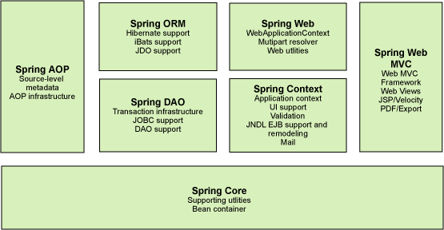

# Spring

## 1. Spring

### 1.1 简介

* Spring：春天---> 给软件行业带来春天！
* 2002，首次推出了Spring框架的雏形：interface21框架
* Spring框架即以interface21框架为基础，经过重新设计，并不断丰富其内涵，于2004年3月24日，发布了1.0正式版
* Rod Johnson，创始人
* Spring理念：使现有的技术更加容易使用，本身是一个大杂烩，整合了现有的技术框架!


* SSH:  Struct2 + Spring + Hibernate
* **SSM: SpringMVC + Spring + Mybatis!**

官网：[Spring Framework](https://spring.io/projects/spring-framework)

官方下载地址：[Index of release/org/springframework/spring](https://repo.spring.io/release/org/springframework/spring/)

GitHub：[spring-projects/spring-framework: Spring Framework (github.com)](https://github.com/spring-projects/spring-framework)

Maven:

```xml
<!-- https://mvnrepository.com/artifact/org.springframework/spring-webmvc -->
<dependency>
    <groupId>org.springframework</groupId>
    <artifactId>spring-webmvc</artifactId>
    <version>5.2.14.RELEASE</version>
</dependency>
<!-- https://mvnrepository.com/artifact/org.springframework/spring-jdbc -->
<dependency>
    <groupId>org.springframework</groupId>
    <artifactId>spring-jdbc</artifactId>
    <version>5.3.5</version>
</dependency>
```

### 1.2 优点

* Spring是一个开源的免费的框架（容器）！
* Spring是一个轻量级的，非侵入式的框架！
* 控制反转（IOC，Inversion of Control），面向切面编程（AOP，Aspect-Oriented Programming）
* 支持事务的处理，对框架整合的支持！

==总结一句话：Spring就是一个轻量级的控制反转（IOC）和面向切面编程（AOP）的框架！==

### 1.3 组成




### 1.4 拓展

Spring Boot: Build anything

Spring Cloud: Coodinate anything

Spring Cloud Data Flow: Connect everything

现代化的Java开发，就是基于Spring开发

* Spring Boot:
  * 一个快速开发的脚手架
  * 基于Spring Boot可以快速开发单个微服务
  * 约定大于配置
* Spring Cloud
  * 基于Spring Cloud是基于Spring Boot实现的

因为现在大多数公司都在使用SpringBoot进行快速开发，学习SpringBoot的前提，需要完全掌握Spring及SpringMVC！承上启下的作用！

**弊端：发展了太久以后，违背了原来的概念！配置十分繁琐，人称“配置地狱”！**


## 2.  IOC理论推导

### 2.1 推导

1. UserDao 接口

   ```java
   public interface UserDao {
       void getUser();
   }
   ```

2. UserDaoImpl 实现类

   ```java
   public class UserDaoImpl implements UserDao{
       @Override
       public void getUser() {
           System.out.println("默认获取用户的数据");
       }
   }
   public class UserDaoMysqlImpl implements UserDao{
       @Override
       public void getUser() {
           System.out.println("Mysql获取用户数据");
       }
   }
   //多个实现类
   ```

3. UserService 业务接口

   ```java
   public interface UserService {
       void getUser();
   	
       //业务接口注入
       void setUserDao(UserDao userDao);
   }
   ```

4. UserServiceImpl 业务实现类

   ```java
   public class UserServiceImpl implements UserService{
   
       private UserDao userDao;
   
       //利用set进行动态实现值的注入
       public void setUserDao(UserDao userDao) {
           this.userDao = userDao;
       }
       
       @Override
       public void getUser() {
           userDao.getUser();
       }
   }
   ```

在我们之前的业务中，用户的需求可能会影响我们原来的代码，我们需要根据用户的需求去修改源代码！如果程序代码量十分大，修改一次的成本代价十分昂贵！


我们使用了一个set接口实现

```java
//利用set进行动态实现值的注入
public void setUserDao(UserDao userDao) {
    this.userDao = userDao;
}
```

* 之前，程序是主动创建对象！控制权在程序员手上！
* 使用了set注入后，程序不再具备主动性，而是变成了被动的接受对象！

这种思想，从本质上解决了问题，我们程序员不用去管理对象的创建了。系统的耦合性大大降低，可以更加专注在业务的实现上！这是IOC的原型。


### 2.2 本质

**控制反转IoC (Inversion of Control)，是一种设计思想，DI (依赖注入) 是实现IoC的一种方法**，也有人认为DI只是IoC的另一种说法。没有IoC的程序中，我们使用面向对象编程，对象的创建与对象间的依赖关系完全硬编码在程序中，对象的创建由程序自己控制，控制反转后将对象的创建转移给第三方，个人认为所谓控制反转就是：获得依赖对象的方式反转了。


采用XML方式配置Bean的时候，Bean的定义信息是和实现分离的，而采用注解的方式可以把两者合为一体，Bean的定义信息直接以注解的形式定义在实现类中，从而达到了零配置的目的。

**控制反转是一种通过描述 (XML或注解) 并通过第三方去生产或获取特定对象的方式。在Spring中实现控制反转的是IoC容器，其实现方法是依赖注入 (Dependency Injection, DI)。**


3.